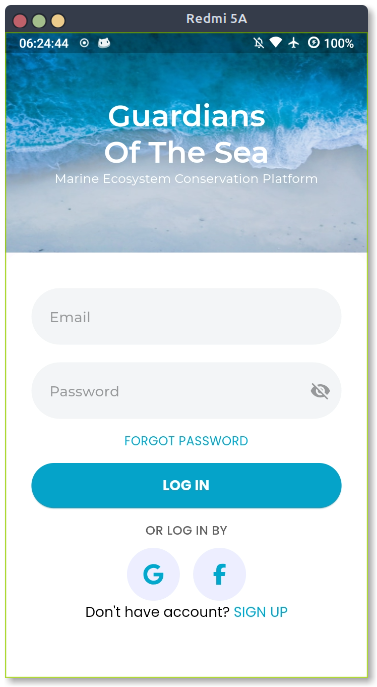
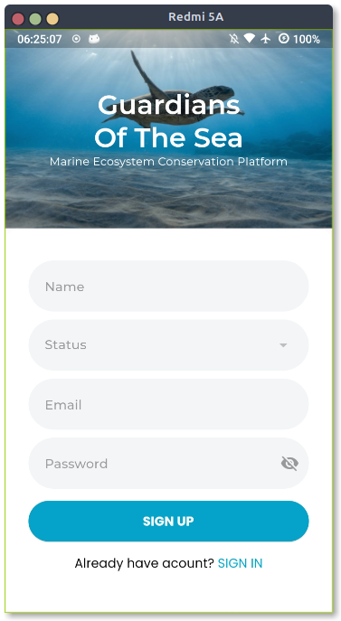
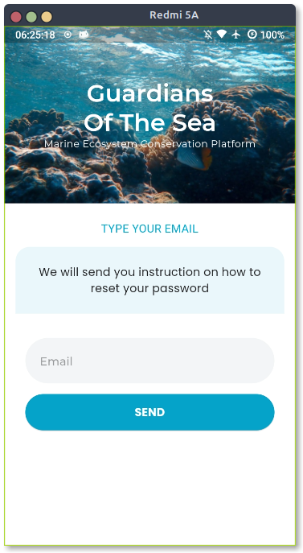

<h1 align="center">Laut Kita</h1>

## 📌 Overview

Laut Kita is an application designed for marine ecosystem conservation, facilitating collaboration between environmental care communities, volunteers, and environmental organizations. The application integrates social media to raise awareness of maritime issues and support the sustainability of marine ecosystems. Its main features include opportunities to participate as volunteers, make donations, and a marketplace that supports marine cleaning activities and the preservation of marine life.

## 📸 Screenshots

#### Login Page

#### Sign Up Page

#### Forgot Password Page

## 🤝 Teams

Team Name: **Lakse Basah**

- Audy Naufal Ghiffari **(Hustler)**
- Galih Tri Risky Andiko **(Hipster)**
- Charles Bintang **(Hacker)**
- Ari Kurniawan **(Hacker)**
